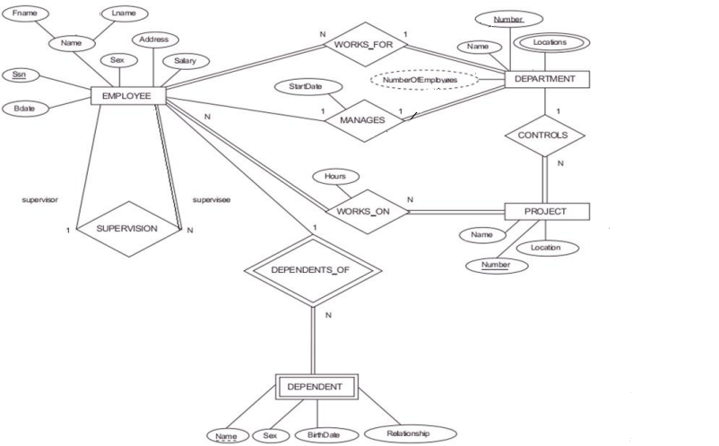
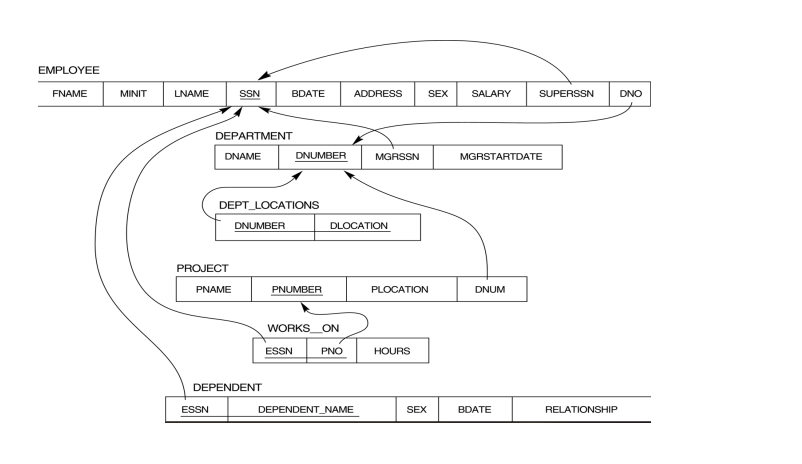
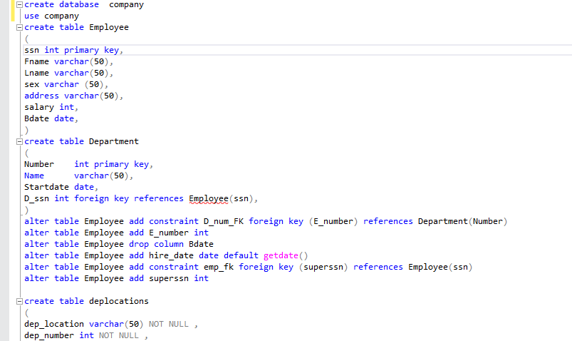
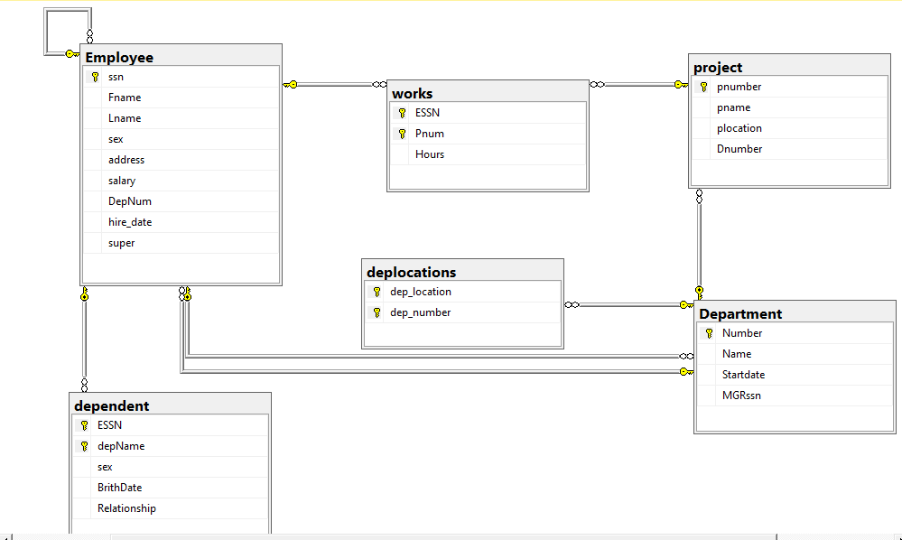

# 📊 SQL Database Project

This project demonstrates the **design and implementation of a complete database system** starting from requirements analysis to final deployment on **SQL Server**.

---

## 📂 Project Contents
- `database.sql` → SQL script to create the database schema and insert sample data.  
- `database.bak` → Backup file of the database (can be restored directly in SQL Server).  
- `1.png` → Entity Relationship Diagram (ERD).  
- `2.png` → Database Schema diagram.  
- `3.png` → Screenshot of the SQL code used to build the database.  
- `4.png` → Database diagram view inside SQL Server.  

---

## 🛠️ Tools & Technologies
- **SQL Server**  
- **SQL Server Management Studio (SSMS)**  
- **ERD Design**  
- **Database Schema & Normalization**  

---

## 🚀 Features
- Full database design from scratch.  
- ERD showing entities and relationships.  
- Schema creation with up to 6 tables.  
- Primary & Foreign Keys for data integrity.  
- Sample data insertion for testing.  
- Backup and SQL script for easy sharing and restoration.  

---

## 📸 Screenshots
### ERD

### Database Schema

### SQL Code

### Database Diagram

---

## 🔧 How to Use
1. **Option 1: Run SQL Script**  
   - Open `database.sql` in SSMS.  
   - Execute the script to create the database and tables.  

2. **Option 2: Restore Backup**  
   - In SSMS: Right click **Databases → Restore Database**.  
   - Select `database.bak` and restore.  

---

## 📌 Outcome
A well-structured, scalable, and efficient database that covers the full cycle:  
**Requirements → ERD → Schema → Implementation → Testing**.  

---

## 👨‍💻 Author
- **Mohamed Hassan**  
- 📧 [mohamedhassanmasoud95@gmail.com]  
- 🔗 [LinkedIn](https://www.linkedin.com/in/mohamed---hassan)  
